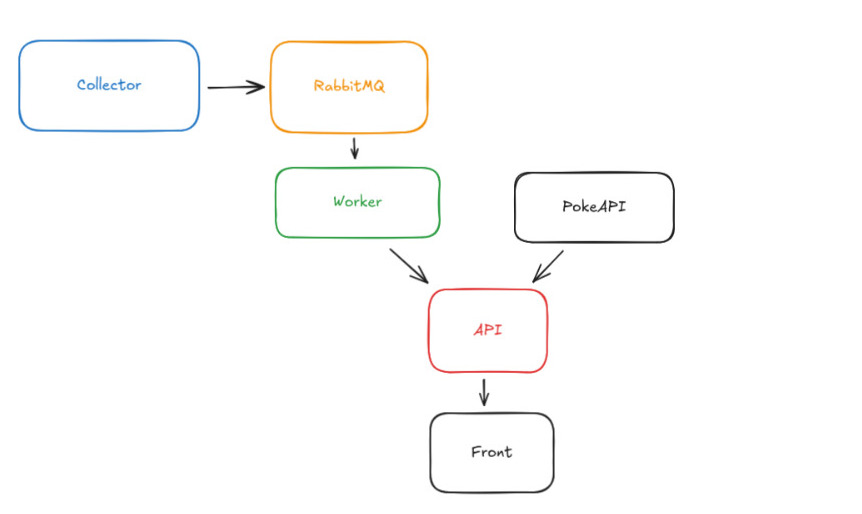

# GDASH 2025/02 – Weather AI Pipeline 🌤️🤖

Repositório de conclusão do **Desafio GDASH 2025/02**, implementando um pipeline completo de dados climáticos com **coleta em Python**, **fila + worker em Go**, **API em NestJS + MongoDB**, **frontend em React/Vite/Tailwind/shadcn/ui** e **insights de IA gerados com OpenAI**.

Toda a solução roda via **Docker Compose** e está organizada em 4 serviços principais:

- `/backend` → API (NestJS + MongoDB + OpenAI)
- `/collector` → Coletor de clima (Python + OpenWeather)
- `/worker` → Worker da fila (Go + RabbitMQ)
- `/frontend` → Dashboard web (React + Vite + Tailwind + shadcn/ui)

---

## 🔭 Visão geral da solução

A aplicação implementa o fluxo completo proposto no desafio:

1. **Coleta dados climáticos reais** de Recife/BR usando **OpenWeather**, em um serviço Python.
2. O coletor envia snapshots normalizados para uma **fila RabbitMQ**.
3. Um **worker em Go** consome a fila, faz validações e envia os registros para a **API NestJS**.
4. A **API** persiste os dados em **MongoDB** como documentos `WeatherSnapshot`.
5. A partir desses snapshots, a API usa **OpenAI** para gerar e salvar documentos `WeatherInsight` com:
   - resumo do clima;
   - alertas;
   - métricas agregadas;
   - insights descritivos.
6. O **frontend** (React + Vite + Tailwind + shadcn/ui) exibe:
   - dashboard com dados climáticos;
   - gráficos (hourly/daily);
   - insights de IA;
   - exportação CSV/XLSX;
   - autenticação + CRUD de usuários;
   - página opcional integrada à **PokéAPI** via backend.

---

## 🎥 Vídeo de apresentação

Link do vídeo (YouTube – não listado):

[INSERIR LINK AQUI]

No vídeo foram abordados:

- visão geral da arquitetura;

- fluxo Python → RabbitMQ → Go → NestJS → MongoDB → Frontend;

- geração e exibição de insights de IA com OpenAI;

- principais decisões técnicas;

- demonstração da aplicação rodando via Docker Compose.

---

## ⚙️ Como rodar o projeto

#### 1. Pré-requisitos

Docker

Docker Compose

(Opcional) Node.js e Go/Python locais para rodar serviços em modo dev

#### 2. Variáveis de ambiente

Na raiz de cada serviço existe um arquivo:

```
.env.example
```

Execute esse comando para copiar todos os .env.example criar um .env com todos os dados preenchidos:

```
cp backend/.env.example backend/.env && \
cp collector/.env.example collector/.env && \
cp worker/.env.example worker/.env && \
cp frontend/.env.example frontend/.env
```

#### 3. Subindo tudo com Docker Compose

Na raiz do projeto:

```
docker compose up --build
```

##### Isso deve subir:

- API NestJS
- Frontend Vite
- RabbitMQ
- MongoDB
- Collector (Python)
- Worker (Go)

#### 4. URLs principais

Os ports exatos podem variar conforme o `docker-compose.yml`. Ajuste aqui se tiver modificado.

- Frontend (Dashboard): http://localhost:5173
- Backend API: http://localhost:3000
- Swagger/OpenAPI: http://localhost:3000/api/docs

#### 5. Login padrão

Usuário padrão criado automaticamente na inicialização da API (configurável via .env):

- E-mail: `admin@example.com`
- Senha: `123456`

Use esse usuário para:

- acessar o dashboard autenticado;
- gerenciar outros usuários através do CRUD.

#### Rodar serviços individualmente (modo dev)

##### Backend

```
cd backend
npm install
npm run start:dev
```

##### Frontend

```
cd frontend
npm install
npm run dev
```

##### Collector

```
cd collector
pip install -r requirements.txt
python main.py
```

##### Worker

```
cd worker
go run .
```

---

## 🧱 Arquitetura

A solução é composta por quatro serviços principais que se comunicam de forma assíncrona através de uma fila (RabbitMQ), tendo a API NestJS como ponto central de orquestração:

#### 1. Collector (Python → RabbitMQ)

- A cada 10 minutos, o serviço collector consulta a API do OpenWeather para Recife/BR.
- Os dados são normalizados em um objeto WeatherSnapshot.
- Esse snapshot é publicado em uma fila do RabbitMQ em formato JSON.

#### 2. Worker (Go → API NestJS)

- O serviço worker (Go) consome as mensagens da fila.

- Para cada `WeatherSnapshot`:
  - valida a estrutura do JSON;
  - aplica transformações necessárias;
  - envia o payload para a API NestJS via HTTP (endpoint de criação de snapshots);
  - realiza ack/nack na fila e faz retry básico em caso de falha.

#### 3. API (NestJS → MongoDB, OpenAI, PokéAPI)

- A API recebe os snapshots e os persiste no MongoDB como documentos WeatherSnapshot.

- A partir do snapshot mais recente, um caso de uso dedicado:

  - monta um prompt com dados current, hourly e daily;

  - chama a OpenAI;

  - parseia a resposta e salva um documento WeatherInsight tipado.

- A API também:

  - expõe endpoints para listagem, filtros e exportação em CSV/XLSX;

  - implementa autenticação + CRUD de usuários;

  - age como proxy para a PokéAPI, expondo endpoints paginados consumidos pelo frontend.

#### 4. Frontend (React/Vite → API NestJS)

- O frontend não fala diretamente com nenhum serviço externo: tudo passa pela API.

- Ele consome:

  - os WeatherSnapshot para gráficos e tabelas;

  - os WeatherInsight para resumos, alertas e métricas agregadas;

  - os endpoints de exportação CSV/XLSX;

  - os endpoints de usuários (login + CRUD);

  - a integração paginada com a PokéAPI.

O diagrama abaixo resume o fluxo de dados:

```
OpenWeather → Collector (Python) → RabbitMQ → Worker (Go) → API (NestJS) → MongoDB
                                                              ↓
                                                          OpenAI (IA)
                                                              ↓
                                                         Frontend (React)

```



## 🧰 Tecnologias utilizadas

#### Frontend

- React + Vite
- TypeScript
- Tailwind CSS
- shadcn/ui

#### Backend

- NestJS (TypeScript)
- MongoDB
- OpenAI API (insights de IA)
- Integração com PokéAPI (API opcional paginada)
- Pipeline de dados

#### Collector

- Python
- OpenWeather (dados climáticos)

#### Worker

- Go
- RabbitMQ (message broker)
- Infra
- Docker
- Docker Compose

## 🌦️ Modelo de dados – WeatherSnapshot

Os snapshots climáticos são normalizados pela API seguindo a estrutura WeatherSnapshot:

```
{
  "provider": "openweather",
  "type": "snapshot",
  "location": {
    "city": "Recife",
    "country": "BR",
    "lat": -8.0539,
    "lon": -34.8811,
    "timezone": "America/Recife",
    "timezoneOffset": -10800
  },
  "fetchedAt": "2025-11-22T14:17:37.727822+00:00",
  "current": {
    "timestamp": "2025-11-22T14:17:28+00:00",
    "temperature": 29.02,
    "feelsLike": 32.77,
    "humidity": 70,
    "pressure": 1014,
    "dewPoint": 22.99,
    "uvi": 12.48,
    "clouds": 40,
    "visibility": 10000,
    "windSpeed": 5.14,
    "windDeg": 70,
    "rainLastHour": 0,
    "rainProbability": 0,
    "condition": {
      "id": 802,
      "main": "Clouds",
      "description": "scattered clouds",
      "icon": "03d"
    }
  },
  "hourly": [
    {
      "timestamp": "2025-11-22T14:00:00+00:00",
      "temperature": 29.02,
      "feelsLike": 32.77,
      "humidity": 70,
      "pressure": 1014,
      "uvi": 12.48,
      "rainProbability": 0.24,
      "condition": {
        "id": 802,
        "main": "Clouds",
        "description": "scattered clouds"
      }
    }
    // ...
  ],
  "daily": [
    {
      "date": "2025-11-22",
      "tempMin": 25.58,
      "tempMax": 29.47,
      "humidity": 70,
      "uvi": 12.63,
      "rainProbability": 1,
      "rainAmount": 1.01,
      "condition": {
        "id": 500,
        "main": "Rain",
        "description": "light rain"
      }
    }
    // ...
  ]
}
```

#### Esse modelo é otimizado para:

- análise de tendência de temperatura;
- cálculo de índice de conforto térmico;
- detecção de chuvas e alertas de risco;
- visualização de séries temporais (hourly e daily) no dashboard.

## 🤖 Modelo de dados – WeatherInsight

Os insights de IA são gerados a partir do último WeatherSnapshot utilizando OpenAI e persistidos como WeatherInsight:

```
{
  "id": "69341f9b79f8f3f86d33c9e6",
  "snapshotId": "693393c9c075e1a8b8d9dbff",
  "summary": "Clima em Recife apresenta temperaturas elevadas e alta umidade...",
  "alerts": [
    {
      "type": "chuva_leve",
      "description": "Previsão de chuvas leves persistentes durante o dia...",
      "severity": "medium",
      "icon": "rain_light"
    },
    {
      "type": "uv_alto",
      "description": "Índice UV atinge valores elevados...",
      "severity": "high",
      "icon": "uv_high"
    }
  ],
  "metrics": {
    "comfortIndex": 55,
    "trendTemperature": "estável",
    "trendRain": "aumentando"
  },
  "insights": [
    {
      "title": "Temperatura e Umidade",
      "description": "Temperaturas diurnas mantêm-se elevadas..."
    },
    {
      "title": "Previsão de Chuvas",
      "description": "Chuvas leves são esperadas principalmente..."
    }
    // ...
  ],
  "createdAt": "2025-12-06T12:20:43.432Z"
}
```

#### No backend, um use case dedicado:

- carrega o WeatherSnapshot mais recente;
- monta um prompt com os dados current/hourly/daily;
- chama a API da OpenAI;
- parseia a resposta no formato tipado acima;
- salva o WeatherInsight já estruturado em MongoDB.

#### O frontend consome esses insights para:

- exibir um resumo geral do dia;
- mostrar alertas categorizados por severidade;
- exibir métricas agregadas (comfortIndex, tendência de temperatura/chuva);
- renderizar seções de insights textuais detalhados.

## 🎯 Decisões técnicas e destaques

- **Normalização de dados climáticos** em `WeatherSnapshot` para facilitar gráficos, agregações e análise de IA.

- **Separação clara de responsabilidades:**

  - Python foca em coleta e normalização inicial;

  - Go foca em orquestrar fila → API, validação e observabilidade;

  - NestJS centraliza regras de negócio, IA e persistência;

  - Frontend consome tudo por meio de uma API única.

- **Uso de OpenAI** para gerar insights ricos:

  - resumo geral do clima;

  - alertas com severidade;

  - índice de conforto e tendências;

  - explicações em linguagem natural.

- **Frontend com shadcn/ui** para uma experiência consistente:

  - cards, accordions, tabelas, dialogs, toasts;

  - dashboard focado em UX e clareza das informações.

- **Integração com PokéAPI** feita no backend:

  - o frontend nunca chama a API pública diretamente;

  - paginação implementada na API, seguindo o espírito do desafio.

---

## ✅ Checklist rápido

- [x] Python coleta dados de clima (Open-Meteo ou OpenWeather)
- [x] Python envia dados para a fila
- [x] Worker Go consome a fila e envia para a API NestJS
- [x] API NestJS:
  - [x] Armazena logs de clima em MongoDB
  - [x] Exponde endpoints para listar dados
  - [x] Gera/retorna insights de IA (endpoint próprio)
  - [x] Exporta dados em CSV/XLSX
  - [x] Implementa CRUD de usuários + autenticação
  - [x] (Opcional) Integração com API pública paginada
- [x] Frontend React + Vite + Tailwind + shadcn/ui:
  - [x] Dashboard de clima com dados reais
  - [x] Exibição de insights de IA
  - [x] CRUD de usuários + login
  - [x] (Opcional) Página consumindo API pública paginada
- [x] Docker Compose sobe todos os serviços
- [x] Código em TypeScript (backend e frontend)
- [x] Vídeo explicativo (máx. 5 minutos)
- [x] Pull Request via branch com seu nome completo
- [x] README completo com instruções de execução
- [x] Logs e tratamento de erros básicos em cada serviço

---
